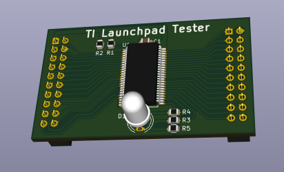

# LaunchpadTester
This is a small TI-LaunchPad compatible boosterpack board,
which can be used for testing all GPIO pins on a TI LaunchPad.

_Background:_ When using TI Launchpads for educational purposes,
some of the IO-pins might be destroyed by students. So I needed
a simple way to test all IO pins of such boards before using
the boards during the next semester.

I had some spare [CY8C9540A](http://www.cypress.com/file/37971/download)
chips from Cypress and some 5mm 3-color LEDS, which are now used on
this board. The CY8C9540A is a GPIO expander with 40 IO pins and a
(slow) I2C interface. It also supports a programmable PWM signal on
all pins. Two of the Launchpad IO pins are used for the I2C interface
to operate the CY8C9540A. When the CY8C9540A is not detected by the
Launchpad, we at least know that these two pins are not working :).

When the CY8C9540A is detected by software, we can test every single
Launchpad pin in input- and output-mode by programming the connected
CY8C9540A-pin.

The 3-color LED can be used to show the results of the tests.

This project contains the hardware design files, which were developed
using [KiCad EDA](http://kicad-pcb.org/). The related software will be
published in a separate project.
